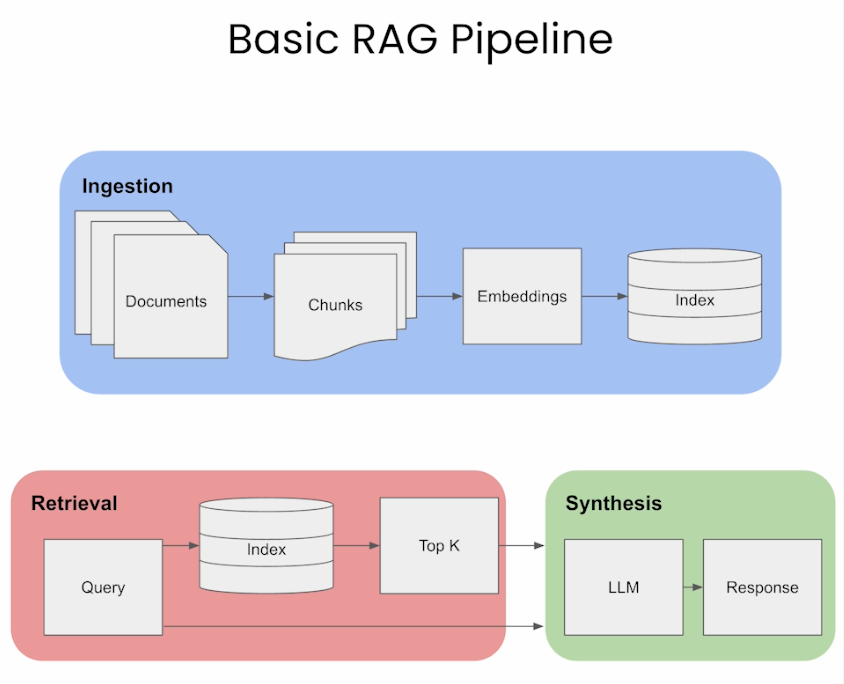

# RAG-based LLM for scikit-learn documentation

This is a all components to build a RAG-based LLM for the scikit-learn documentation.

## Installation

```bash
pip install -r requirements.txt
```

## Starting the server

```bash
cd app
make start
```

The server can be access to:

```bash
http://localhost:8123
```

## RAG-based LLM

We can represent a RAG-based LLM as follow [1]:



## References

[1] https://vinija.ai/nlp/RAG/
